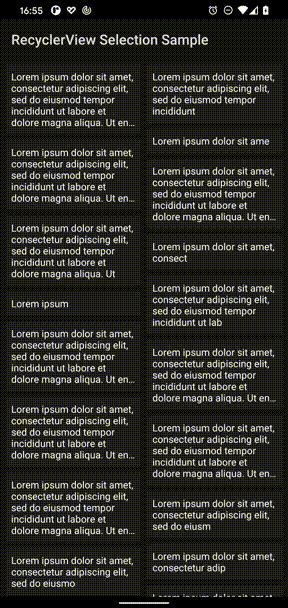

# RecyclerView-Selection Sample

[androidx.recyclerview.selection](https://developer.android.com/reference/androidx/recyclerview/selection/package-summary)

## How to change the selection mode
- single selection
  - SelectionPredicates.createSelectSingleAnything()
- multiple selection
  - SelectionPredicates.createSelectAnything()
  

